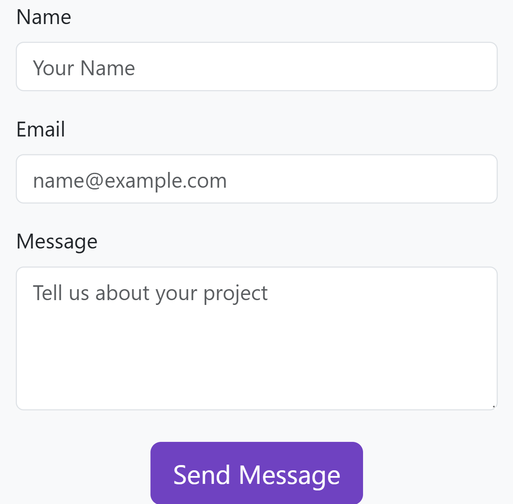
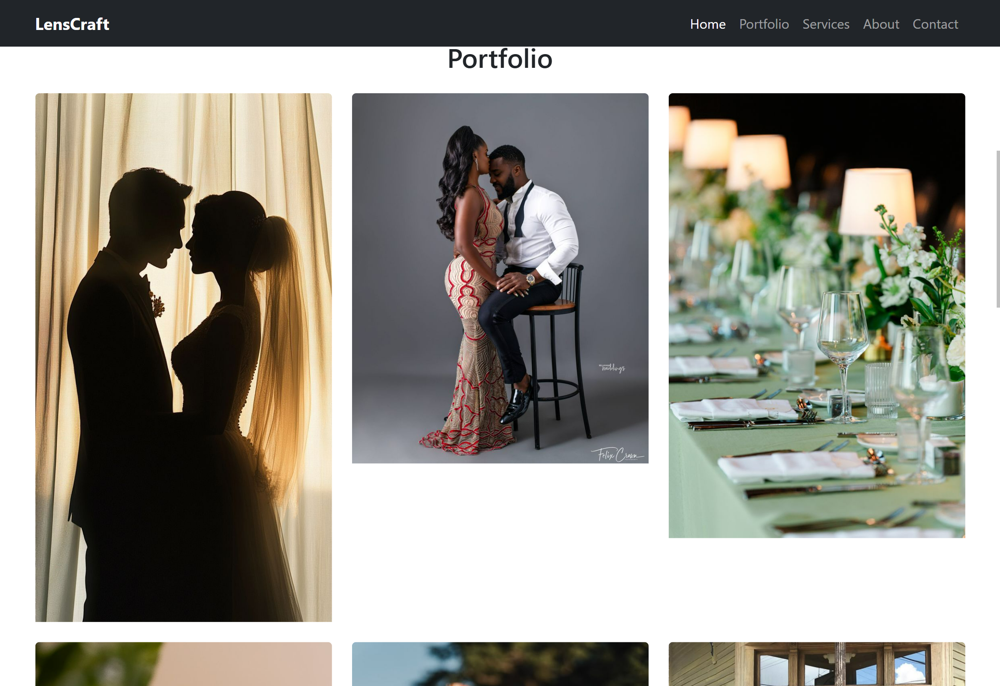
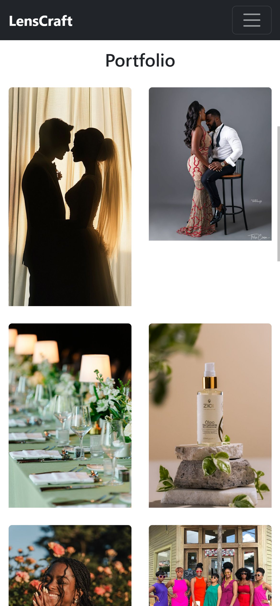

#Reen's Studios 

A fully responsive front-end website for a fictional photography and videography brand, built using **Bootstrap 5** (no custom JavaScript). This single-page design demonstrates mobile-first layouts, modern components, and semantic HTML5 practices.

Built as part of the advannced front end development course, this project showcases a clean, user-friendly portfolio website for creatives.

---

##Features

- *Fixed Navbar* with smooth scrolling
- *Hero Section* with background image overlay & call-to-action buttons
- *Portfolio Gallery* in a responsive 3x2 grid
- *Service Cards* using Bootstrap Icons
- *About Section* with image + text layout
- *Contact Form* using Bootstrap's form layout classes
- *Dark Footer* with social media links
- Consistent *purple branding* (custom theme)

---

#Technologies Used

- *HTML5*
- *Bootstrap 5.3.3*
- *Bootstrap Icons*
- *Responsive Design Principles*

---

## Screenshots


| 📸 Original Design | 💻 Desktop View | 📱 Mobile View |
|--------------------|----------------|----------------|
|  |  |  |
|  |  |  |

---

#How to Run

1. Clone or download this repository:
   ```bash
   git clone https://github.com/ALU-BSE/week-7-missmbuvi04.git
   cd lenscraft-bootstrap
